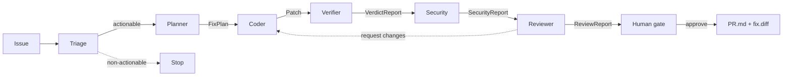

[English](./README_EN.md)

# TrustBand


> 一支在 [Band](https://www.band.ai/) 上协作的 agent band,把 bug/issue 变成"可信到敢合"的修复 PR。
>
> **Don't just write code — earn the merge.**

## 它解决什么

让 AI 写代码已经不稀奇,难的是**敢不敢合**。TrustBand 把多个专业化 agent 编排在 Band 的共享 room 里协作:规划、改代码、**验证**、评审、人工审批,最后产出一个带"可信背书"的 PR。

差异点在 **Verifier agent**:它不靠 LLM 自评,而是跑真实路径测试 + 回归检查 + 轨迹断言,用确定性证据决定这个修复值不值得合。

## 架构



6 个专业 agent + 人审门,每条箭头都是经 `AgentBus` 交接的强类型结构化产物。可信靠两条互补防线:**Verifier** 抓测试没覆盖的回归,**Security** 抓测试全过但有风险(如 `eval`)的补丁。详见 [docs/architecture.md](./docs/architecture.md)。

## Agents

| Agent | 职责 | 产物 |
|---|---|---|
| Triage | 分类 + 判定是否可处理(决策门) | `TriageReport` |
| Planner | 读 issue + repo,定位根因 | `FixPlan` |
| Coder | 按 plan 出补丁(可接 Claude Code / Codex) | `Patch` |
| **Verifier** | 真实路径测试 + 回归 + 轨迹断言 | `VerdictReport` |
| Security | 确定性扫描 eval/exec/shell/硬编码密钥 | `SecurityReport` |
| Reviewer | 汇总 Verifier+Security 证据,可要求改稿 | `ReviewReport` |
| Human gate | 看证据后 approve / decline | `Decision` |

非可执行的 issue 在 Triage 处早停;regressing/risky 的补丁触发 Coder 改稿回环。所有 handoff、结构化上下文交换、人审都经由 Band(`--bus band`),也可用内存假总线离线运行(`--bus memory`)。

## 快速开始(离线、免费、确定性)

```bash
uv sync
uv run pytest -q
uv run trustband run --scenario discount         # 一条命令跑通一个修复
uv run trustband run --scenario regression_trap  # 看 Verifier 拦回归 + 改稿回环
uv run trustband run --scenario risky_fix        # 看 Security 拦下 eval
uv run trustband bench                           # 全部展示场景的效果指标
```

离线模式不需要任何 API key。接真 Band / 真 LLM 见 [SETUP.md](./SETUP.md)。

## 测试效果数据

`uv run trustband bench` 在 5 个展示场景上确定性复现:

| 指标 | 值 |
|---|---|
| 正确结局 | 5/5 (100%) |
| 修复合入 | 4 |
| Verifier 拦下的坏补丁 | 1 |
| 阻止的回归 | 1 |
| Security 拦下的风险补丁 | 1 |
| 非可执行被过滤 | 1 |

完整报告见 [docs/benchmark.md](./docs/benchmark.md)。

## 状态

开发中(Band of Agents Hackathon,2026-06)。架构图与 demo 见 Phase 5 产物。
