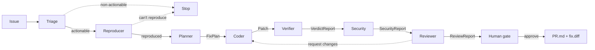

[中文](./README.md)

# TrustBand


> A band of agents collaborating on [Band](https://www.band.ai/) that turns a bug/issue into a fix PR you can trust enough to merge.
>
> **Don't just write code — earn the merge.**

## What it solves

Making an AI write code is no longer the hard part; trusting it enough to merge is. TrustBand orchestrates specialized agents in a shared Band room — planning, coding, **verifying**, reviewing, and human approval — and produces a PR backed by deterministic evidence.

The differentiator is the **Verifier agent**: instead of an LLM grading itself, it runs real execution-path tests, regression checks, and trajectory assertions, then decides on evidence whether the fix has earned the merge.

## Architecture



Seven specialized agents plus a human gate; every arrow is a typed artifact over the `AgentBus`. Trust rests on two complementary checks — the **Verifier** catches regressions the tests miss, and the **Security** agent catches risky-but-passing patches (e.g. `eval`); when no failing test exists, the **Reproducer** authors one first. See [docs/architecture.md](./docs/architecture.md).

## Agents

| Agent | Responsibility | Output |
|---|---|---|
| Triage | Classify + decide if actionable (decision gate) | `TriageReport` |
| Reproducer | Prove the bug reproduces; author a failing test if none exists | `ReproReport` |
| Planner | Read the issue + repo, locate the root cause | `FixPlan` |
| Coder | Produce a patch from the plan (can wrap Claude Code / Codex) | `Patch` |
| **Verifier** | Real-path tests + regression + trajectory assertions | `VerdictReport` |
| Security | Deterministic scan for eval/exec/shell/hardcoded secrets | `SecurityReport` |
| Reviewer | Aggregates Verifier + Security evidence, can request changes | `ReviewReport` |
| Human gate | Approve / decline after seeing the evidence | `Decision` |

Non-actionable issues stop at Triage; regressing or risky patches trigger a Coder revision loop. All handoffs, structured context exchange, and human approval flow through Band (`--bus band`); an in-memory fake bus runs the same pipeline offline (`--bus memory`).

## Quickstart (offline, free, deterministic)

```bash
uv sync
uv run pytest -q
uv run trustband run --scenario discount          # fix one bug end to end
uv run trustband run --scenario regression_trap   # Verifier catches a regression, loops
uv run trustband run --scenario risky_fix         # Security catches an eval()
uv run trustband bench                            # effect metrics across all scenarios
```

Offline mode needs no API keys. For live Band / real LLMs, see [SETUP.md](./SETUP.md).

## Effect metrics

`uv run trustband bench` reproduces deterministically across 5 showcase scenarios:

| metric | value |
|---|---|
| correct outcomes | 6/6 (100%) |
| fixes shipped | 5 |
| bad patches caught by Verifier | 1 |
| regressions prevented | 1 |
| risky patches caught by Security | 1 |
| non-actionable filtered | 1 |

Full report: [docs/benchmark.md](./docs/benchmark.md).

## Engineering quality

CI (`.github/workflows/ci.yml`) runs ruff + mypy + 61 tests (89% coverage) + the benchmark on every push. Local equivalent: `bash scripts/smoke.sh`.

## Status

Under active development (Band of Agents Hackathon, June 2026). Architecture diagram and demo land in Phase 5.
