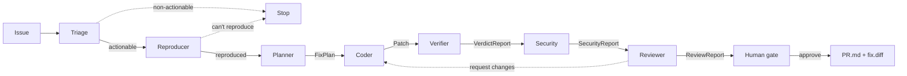

# TrustBand — Usage & Introduction

> A band of agents collaborating on [Band](https://www.band.ai/) that turns a
> bug/issue into a fix PR you can trust enough to merge.
>
> **Don't just write code — earn the merge.**

This is the complete usage and feature reference. For a short overview see
[README](../README.md); for design rationale see [architecture.md](./architecture.md);
for the metrics see [benchmark.md](./benchmark.md).

---

## 1. What it is, and why

Making an AI write code is no longer the hard part — trusting it enough to merge
is. TrustBand orchestrates seven specialized agents in a shared Band room. They
plan, code, **verify**, security-scan, review, and seek human approval, and
produce a PR backed by deterministic evidence rather than an LLM grading itself.

Trust rests on **two complementary checks**:

- the **Verifier** runs the target suite before and after the patch and rejects
  anything that regresses — even if the target test passes;
- the **Security** agent rejects risky-but-passing patches (e.g. `eval`), which
  no amount of test-passing would catch.

When a bug has no failing test yet, the **Reproducer** authors one first, so the
red→green evidence is real.

---

## 2. The band



| Agent | Responsibility | Output |
|---|---|---|
| Triage | Classify + decide if actionable (decision gate) | `TriageReport` |
| Reproducer | Prove the bug reproduces; author a failing test if none exists | `ReproReport` |
| Planner | Locate the root cause, plan the fix | `FixPlan` |
| Coder | Produce a patch (full file contents per change) | `Patch` |
| **Verifier** | Real-path tests + regression + trajectory assertions | `VerdictReport` |
| Security | Regex heuristics (always) + optional bandit SAST | `SecurityReport` |
| Reviewer | Aggregate Verifier + Security evidence; can request changes | `ReviewReport` |
| Human gate | Approve / decline after seeing the evidence | `Decision` |

Only a **trustworthy verdict + clean security + reviewer approval** reaches the
human gate; the Coder/Verifier/Security/Reviewer steps loop (default max 2) so a
regressing or risky patch is revised. Everything is exchanged as typed Pydantic
artifacts over the `AgentBus`, and the room transcript shows every handoff.

---

## 3. The two seams (offline ↔ live)

Two interfaces keep the system testable offline and provider-agnostic:

| Seam | Offline impl | Live impl |
|---|---|---|
| `AgentBus` | `InMemoryBus` (deterministic) | `BandBus` (real Band room) |
| `LLMClient` | `FakeLLM` (canned, deterministic) | `OpenAILLM` / `RealLLM` (real models) |

The offline path needs no network and no API keys — that is what the test suite
and the benchmark run on.

---

## 4. Install

```bash
uv sync                # offline only (no API libraries)
uv sync --extra live   # also installs anthropic + band-sdk + httpx for live mode
```

Requires Python 3.11+ (uv fetches one if needed).

---

## 5. Quickstart (offline, free, deterministic)

```bash
uv run pytest -q                                   # 93 tests
uv run trustband run --scenario discount           # one bug -> verified PR
uv run trustband run --scenario regression_trap    # Verifier catches a regression, loops
uv run trustband run --scenario risky_fix          # Security catches an eval(), loops
uv run trustband run --scenario no_test            # Reproducer authors a test, then fixes
uv run trustband bench                             # metrics across all scenarios
```

Convenience scripts: `bash scripts/smoke.sh` (ruff + mypy + tests + pipeline + bench),
`bash scripts/demo.sh` (the headline walk-through), `bash scripts/benchmark.sh`.

---

## 6. CLI reference

### `trustband run`

| Flag | Default | Meaning |
|---|---|---|
| `--scenario <name>` | – | Run a bundled showcase scenario (uses its canned FakeLLM) |
| `--repo <path>` | – | Target repository (with `--issue`) |
| `--issue <file>` | – | Issue markdown file |
| `--issue-id <id>` | `BUG-1` | Issue identifier |
| `--bus {memory,band}` | `memory` | Collaboration layer |
| `--band-room <id>` | – | Band chat/room id (required for `--bus band`) |
| `--band-agent <id>` | `orchestrator` | This agent's id on Band |
| `--llm {fake,real}` | `fake` | Fake (canned) or a real model |
| `--coder {local,remote}` | `local` | Use the in-process Coder or a remote coder peer seam |
| `--remote-coder-peer <name>` | `coder` | Remote peer name used by `--coder remote` |
| `--model <id>` | – | Override the model id (e.g. `gpt-5.4-high`) |
| `--bandit` | off | Add bandit SAST to the Security agent |
| `--open-pr` | off | Materialize a real git branch on an isolated clone |
| `--max-revisions <n>` | `2` | Coder↔Reviewer revision rounds |
| `--verifier-scope {full,affected}` | `full` | Run the full suite or affected tests with conservative full-suite fallback |
| `--json` | off | Emit a single machine-readable JSON object on stdout |

Exit code: `0` if merged or correctly filtered as non-actionable, else `1`.

### `trustband bench`

```bash
uv run trustband bench [--out docs/benchmark.md] [--artifacts-dir artifacts/bench] [--json]
uv run trustband bench --llm real --model <id> --json
```

The default benchmark is deterministic and uses each scenario's canned `FakeLLM`.
`--llm real` is opt-in and measures model behavior; each scenario records its own
status so one model/API failure does not abort the whole sweep.

---

## 7. Showcase scenarios

| Scenario | Demonstrates |
|---|---|
| `discount` | Straightforward logic bug, clean one-shot fix |
| `none_guard` | Crash-on-None bug |
| `regression_trap` | Round-1 fix regresses a shared helper; Verifier catches it, round-2 is clean |
| `risky_fix` | Round-1 fix passes tests but uses `eval`; Security catches it, round-2 is safe |
| `no_test` | Bug with no test; the Reproducer authors a failing test, then the fix merges |
| `non_actionable` | A feature request; Triage stops the pipeline early |

---

## 8. Live mode

Store credentials in `~/.config/secrets/api-keys.env` (chmod 600), one
`export NAME="value"` per line — never commit real keys. The repo only ever
reads them from the environment.

### Real LLM — OpenAI-compatible (default real provider)

```bash
export OPENAI_API_KEY="..."                  # your key
export OPENAI_BASE_URL="https://.../v1"       # the OpenAI-compatible endpoint
export TRUSTBAND_MODEL="gpt-5.4-high"         # or pass --model

uv run trustband run --repo <repo> --issue <issue.md> --bus memory --llm real
```

`OpenAILLM` talks raw HTTP, uses `max_completion_tokens`, omits sampling params
(current GPT-5 models reject them), and retries transient network/empty-content
errors. Note: some proxies return empty content for certain models — if that
happens, switch `TRUSTBAND_MODEL` (e.g. `gpt-5.4-high` is known-good).

### Real LLM — Anthropic (alternative)

Set `ANTHROPIC_API_KEY` (and leave `OPENAI_API_KEY` unset) to use `RealLLM`
(`claude-opus-4-8` by default). `--llm real` prefers the OpenAI-compatible path
when `OPENAI_API_KEY` is present.

### Band as the active layer

```bash
export BAND_API_KEY="..."     # from band.ai
uv run trustband run --repo <repo> --issue <issue.md> \
  --bus band --band-room <chat_id> --llm real
```

Handoffs and structured context post to the room; the human gate polls the room
for an approve/decline reply.

> **Verified live:** a real model has fixed the bundled `discount` bug end to end
> through the band — including the revision loop (an empty round-1 patch was
> rejected by the Verifier, and the round-2 fix merged).

---

## 9. Metrics

`uv run trustband bench` runs every scenario and writes
[docs/benchmark.md](./benchmark.md): 6 scenarios, 6/6 correct outcomes, 5 merged,
1 regression caught, 1 risky patch blocked, 1 non-actionable filtered.

These measure the **orchestration and decision logic** on canned fixes (FakeLLM)
— they are reproducible but do not measure a real model's coding ability. Run
with `--llm real` to benchmark that.

For CI or dashboard ingestion, use `--json` on either subcommand. JSON output is
not mixed with the human transcript.

---

## 10. Project layout

```
src/trustband/
  contracts.py     # 8 typed artifacts exchanged in the room
  bus.py           # AgentBus + InMemoryBus
  band_bus.py      # BandBus (live Band room)
  llm.py           # LLMClient + FakeLLM + OpenAILLM + RealLLM + parse_with_retry
  agents.py        # Triage, Reproducer, Planner, Coder, SecurityReviewer, Reviewer
  verifier.py      # the Verifier (runner + evidence-based judge)
  runner.py        # isolated pytest runner (junit-xml parsing)
  orchestrator.py  # the pipeline + PR artifact
  git_pr.py        # real git branch on an isolated clone
  benchmark.py     # scenario sweep + metrics
  scenarios.py     # showcase registry + canned FakeLLMs
  cli.py           # `trustband run` / `trustband bench`
fixtures/          # showcase target repos
tests/             # 93 tests
```

---

## 11. Quality gates

CI (`.github/workflows/ci.yml`) runs on every push: **ruff** (lint), **mypy**
(types), **pytest** (93 tests, about 93% coverage, `--cov-fail-under=90`), and
the **benchmark**. Local equivalent: `bash scripts/smoke.sh`.
