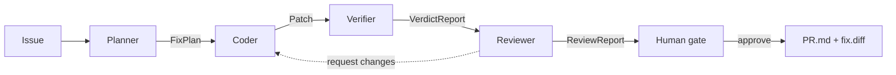

# Architecture

TrustBand orchestrates five roles in a shared Band room. Every arrow below is a
typed artifact handed off over the `AgentBus`; the Verifier's `VerdictReport` is
the gate that the rest of the pipeline depends on.

## Why the Verifier is the differentiator

Most AI-PR tools stop at "the Coder wrote a patch." TrustBand does not trust the
Coder. The Verifier runs the target suite **before and after** the patch in an
isolated copy of the repo, then judges on evidence:

- the target test(s) must go from red to green (`newly_passing`),
- nothing previously green may turn red (`regressions`),
- the whole suite must be green after the patch.

A patch that fixes the target test but silently breaks another is **rejected**,
with the regression named. The Reviewer cannot override that evidence.

## The bus abstraction

`AgentBus` (see `src/trustband/bus.py`) is the seam that keeps the system
testable and provider-agnostic:

| Implementation | Used for | Needs |
|---|---|---|
| `InMemoryBus` | offline, deterministic pipeline + all tests | nothing |
| `BandBus` (Phase 4) | live multi-agent run in a real Band room | `BAND_API_KEY` |

Agents depend only on the interface (`send` / `handoff` / `share_context` /
`request_approval`), so the unverified Band API never leaks into agent logic.
The same seam exists for the model: `FakeLLM` vs `RealLLM` (`src/trustband/llm.py`).

## Structured-context contracts

All handoffs are Pydantic models (`src/trustband/contracts.py`):
`Issue → FixPlan → Patch → VerdictReport → ReviewReport → Decision`. They are
both the "structured context" exchanged in the room and the objective surface
the Verifier and tests assert against.
