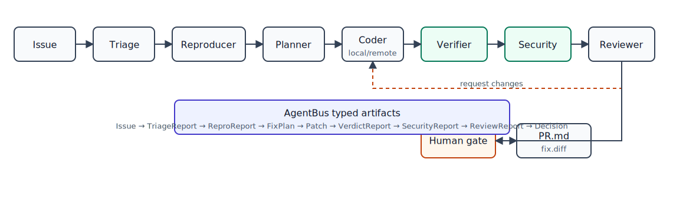
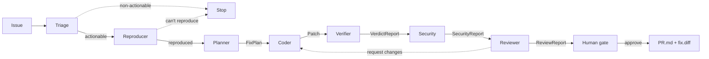

# Architecture

TrustBand orchestrates seven specialized agents plus a human gate in a shared Band
room. Every arrow below is a typed artifact handed off over the `AgentBus`. Trust
rests on two complementary checks — the Verifier (regressions) and the Security
agent (risky-but-passing patches) — and the Reproducer proves the bug first.

## Why the Verifier is the differentiator

Most AI-PR tools stop at "the Coder wrote a patch." TrustBand does not trust the
Coder. The Verifier runs the target suite **before and after** the patch in an
isolated copy of the repo, then judges on evidence:

- the target test(s) must go from red to green (`newly_passing`),
- nothing previously green may turn red (`regressions`),
- the whole suite must be green after the patch.

A patch that fixes the target test but silently breaks another is **rejected**,
with the regression named. The Reviewer cannot override that evidence.

## The second trust dimension: Security

Tests passing is necessary but not sufficient. The Security agent is a
deterministic (non-LLM) static scan for risky constructs — `eval`, `exec`,
`os.system`, `shell=True`, unsafe deserialization, hardcoded secrets. A patch can
make every test green and still be rejected for a critical security finding (the
`risky_fix` scenario uses `eval`). The Reviewer aggregates both reports and the
Coder revises until both clear.

## The bus abstraction

`AgentBus` (see `src/trustband/bus.py`) is the seam that keeps the system
testable and provider-agnostic:

| Implementation | Used for | Needs |
|---|---|---|
| `InMemoryBus` | offline, deterministic pipeline + all tests | nothing |
| `BandBus` (Phase 4) | live multi-agent run in a real Band room | `BAND_API_KEY` |

Agents depend only on the interface (`send` / `handoff` / `share_context` /
`request_approval`), so the unverified Band API never leaks into agent logic.
The same seam exists for the model: `FakeLLM` vs `RealLLM` (`src/trustband/llm.py`).

The Coder also has a remote-peer seam (`src/trustband/remote_agent.py`): the
orchestrator can send a structured remote task and consume a returned `Patch`
instead of calling the in-process Coder. This is the local contract needed for a
Band-hosted Claude Code/Codex peer; the default offline path still uses the local
Coder.

## Structured-context contracts

All handoffs are Pydantic models (`src/trustband/contracts.py`):
`Issue → TriageReport → ReproReport → FixPlan → Patch → VerdictReport →
SecurityReport → ReviewReport → Decision`. They are both the "structured context" exchanged in
the room and the objective surface the Verifier, Security agent, and tests assert
against.

`Patch` supports both full-file replacement and search/replace edits. A single
patch applicator is used by the runner, git materialization, and PR diff rendering
so every path applies the same patch semantics.

## Verifier scoping

The default verifier mode runs the full target suite. `--verifier-scope affected`
can first run selected target tests, but source-file changes conservatively fall
back to the full suite before a trustworthy verdict is issued. This keeps the
regression guarantee intact while providing a path to faster large-repo runs.

## Showcase scenarios + metrics

`src/trustband/scenarios.py` bundles diverse cases (clean fix, crash-on-None,
a regression trap, a risky `eval` fix, a no-test bug where the Reproducer authors
the test, and a non-actionable feature request). Run
`uv run trustband bench` to execute all of them and emit the metrics in
`docs/benchmark.md` — reproducible because the pipeline is offline and
deterministic.
