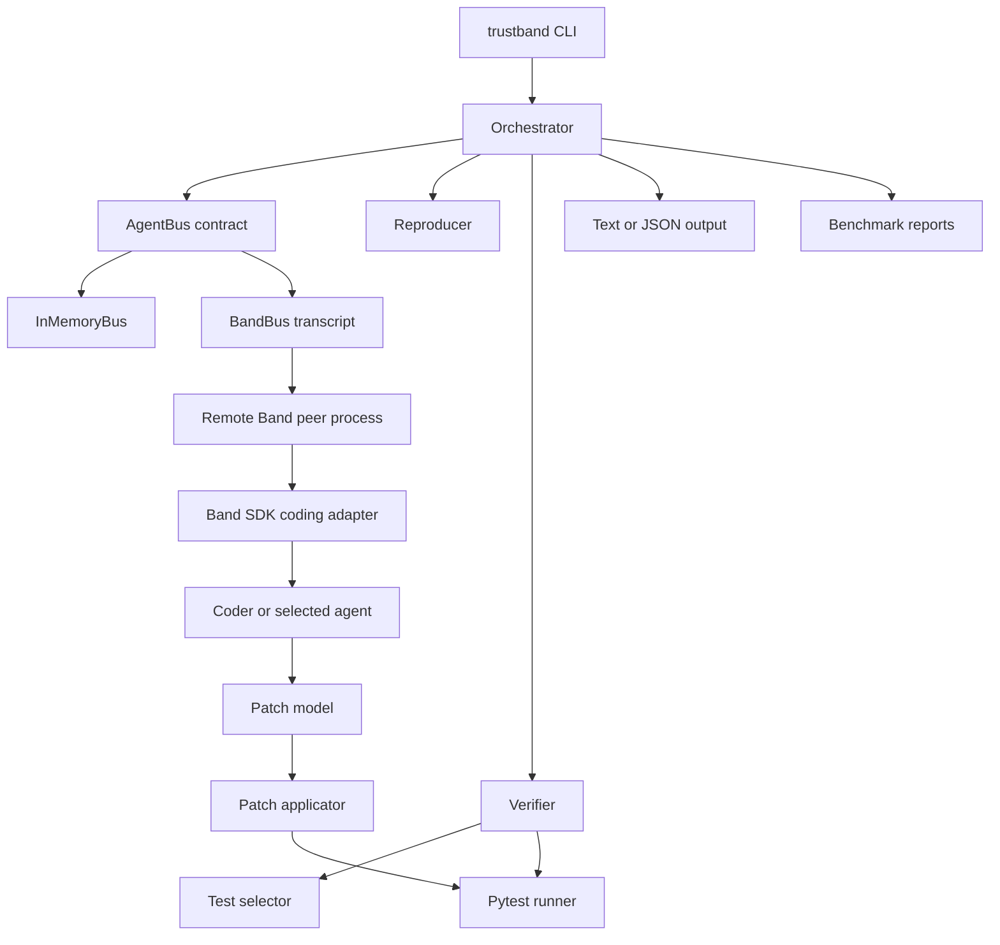
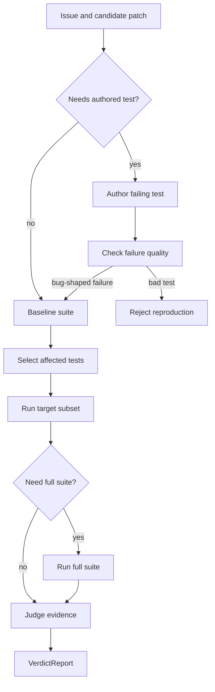
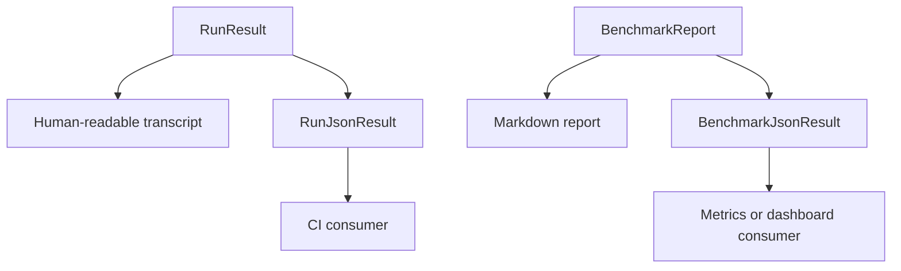

# feat: Implement TrustBand capability roadmap

## Summary

本计划把 `docs/TODO.md` 里仍有代码含义的优化项收束成一条统一实施路线：先把至少一个 agent 变成真实跨进程 Band peer，再增强补丁表达、复现质量、测试调度、CLI 机器可读输出和真实模型 benchmark，最后把覆盖率门槛与架构图资产纳入质量与文档闭环。

非代码事项不进入实施主线：demo video、GitHub org/member 流程、仓库公开流程、API key 轮换操作只保留为外部依赖或后续发布动作。

---

## Problem Frame

TrustBand 当前已经证明了“7 个 in-process agent + Band room transcript + 真人审批”的闭环，也已经有 `InMemoryBus`、`BandBus`、`FakeLLM`、真实 LLM、Verifier、Security 和 benchmark 基线。剩余高价值工作集中在两个方向：让 Band hackathon 的核心卖点从“房间转录”升级为真实跨进程 A2A 协作；让 TrustBand 更像可放入真实 CI 的工具，而不是只适合演示的编排器。

调研时发现一项 TODO 已经基本完成：baseline pytest 已在 `src/trustband/orchestrator.py` 里计算一次并传入 `src/trustband/verifier.py`。该项在本计划中只做回归测试和文档收敛，不再作为主实现任务重复排期。

---

## Requirements

### Band and agent runtime

- R1. 至少一个现有 agent 能作为真实 Band remote participant 独立进程运行，并通过 Band room 接收任务、产出结构化结果、参与主编排。
- R2. 主编排必须保留现有 offline deterministic 路径；没有 Band credentials 时，所有现有测试和 benchmark 行为不退化。
- R3. Band peer 集成必须明确区分发送-only REST transcript 与可接收消息的 remote agent 路径，避免把 room log 冒充为跨进程 agent。

### Patch and verifier capability

- R4. `Patch` 必须支持 diff/edit-based changes，同时兼容当前 full-file replacement 的 fixtures、FakeLLM 和 artifacts。
- R5. Reproducer 必须验证自己写出的 failing test 是因目标 bug 失败，而不是 trivially true、collection error、import error 或与 issue 无关的失败。
- R6. Verifier 必须支持按 affected files/test hints 选择测试子集，并在高风险或无法判定时回退到全量套件。
- R7. baseline pytest 去重的既有行为必须被明确测试，防止后续改动重新引入重复 baseline run。

### CLI, benchmark, and quality gates

- R8. `trustband run` 和 `trustband bench` 必须支持稳定 `--json` 输出，供 CI 或其他工具消费。
- R9. benchmark 必须能区分 deterministic FakeLLM metrics 与真实 LLM metrics，并把模型、bus、场景、预算和失败原因写入机器可读结果。
- R10. coverage gate 应从 80 提高到与当前实际覆盖率更接近的阈值，但不能让 live credential-gated 测试成为 CI 硬依赖。
- R11. README/USAGE/architecture/benchmark/TODO 必须同步反映已完成能力、仍需 credentials 的能力、以及非代码事项的边界。

### Documentation assets

- R12. 架构图应从 Mermaid 源派生为可引用的 PNG 或 SVG 资产，并在 README 中引用，生成流程应可重复。

---

## Key Technical Decisions

- KTD1. Preserve `AgentBus` as the stable in-process contract: 跨进程 Band peer 不直接改写所有 agent；先把一个 agent 包成 remote participant，同时主流程仍通过 `AgentBus`/typed contracts 交接，减少对现有 pipeline 的破坏。
- KTD2. Use Band SDK adapters for remote coding peers when possible: Band 官方文档把 coding agents 定义为 remote agents，经 WebSocket 接收 room 消息，并提供 Claude SDK/Codex adapters；这比在 `BandBus` 上自行轮询消息更接近真实 A2A 目标。
- KTD3. Keep patch compatibility during migration: 新增 edit/diff patch 类型时保留 full-file replacement，避免一次性重写所有 canned scenarios、PR rendering 和 verifier runner。
- KTD4. Make verifier scoping conservative: affected-test selection 只用于加速；当变更影响公共 helper、测试选择为空、选择器失败或风险信号存在时，必须自动跑全量套件。
- KTD5. Treat JSON output as a contract, not formatted stdout: 复用 Pydantic models 或新增稳定 output models，避免从人类可读 transcript 中拼接 JSON。
- KTD6. Separate reproducible benchmark from real-model benchmark: FakeLLM benchmark 继续作为 CI gate；真实 LLM benchmark 作为 gated/opt-in 路径，记录环境和失败原因，不要求 CI 默认有 credentials。
- KTD7. Generate architecture assets from source, not hand-edit images: Mermaid 仍是可审查源，PNG/SVG 是派生产物，避免图和文档漂移。

---

## High-Level Technical Design

### Capability Topology

### Verification Flow

### Output Contract

---

## Scope Boundaries

### In Scope

- 把 TODO 中代码相关能力整理并实施：Band remote peer、real-LLM benchmark、edit patch、reproducer quality gate、verifier scoping、CLI JSON、coverage gate、architecture image、相关文档和测试。
- 保持现有 offline demo、fixtures、benchmark 和 CI 语义可用。
- 用 gated integration tests 覆盖 credentials 相关能力，不把真实 Band/LLM credentials 变成默认 CI 前提。

### Out of Scope

- 录制或剪辑 demo video。
- GitHub org membership、仓库 visibility、collaborator 管理。
- API key 实际轮换操作。
- 建设完整 Web UI、dashboard 或 SaaS 后端。

### Deferred to Follow-Up Work

- 多个 agent 同时 remote 化后的分布式调度、重试、状态恢复。
- 真正创建 GitHub PR 并接入 hosted CI 的完整 release flow。
- 非 Python 目标仓库的 test discovery 和 verifier runner。

---

## System-Wide Impact

- **End users:** CLI 会新增机器可读输出和更强错误报告，原有人类可读 transcript 需要保持默认不变。
- **Agent developers:** `Patch`、`Verifier`、`Reproducer` 和 `BenchmarkReport` 的 contract 会扩展，所有 FakeLLM scenario 都要继续 round-trip。
- **Operations:** 真实 Band peer 和真实 LLM benchmark 需要 credentials，但必须 gated；CI 默认仍可在无密钥环境通过。
- **Documentation:** README、README_EN、USAGE、architecture、benchmark、TODO 都会随着能力完成同步更新。

---

## Implementation Units

### U1. Remote Band peer runtime

**Goal:** 让至少一个 agent 以独立 Band remote participant 运行，主编排能通过 Band room 与它交接结构化任务和结果。

**Requirements:** R1, R2, R3

**Dependencies:** none

**Files:**

- `src/trustband/band_bus.py`
- `src/trustband/bus.py`
- `src/trustband/orchestrator.py`
- `src/trustband/cli.py`
- `scripts/band_demo.sh`
- `scripts/remote_coder.py` or `src/trustband/remote_agent.py`
- `tests/test_llm_clients.py`
- `tests/test_real_band_gated.py`
- `docs/band-findings.md`
- `docs/USAGE.md`
- `SETUP.md`

**Approach:** 先选择 Coder 作为 remote peer，因为 TODO 明确点名 Coder，且它是最能体现 cross-process coding 的 agent。主进程将 `FixPlan` 和 issue context 发布到 room，remote Coder 进程监听 mention 或 structured event，返回 `Patch` payload；本地 Coder 保留为 fallback。优先使用 Band 官方 coding adapter 或 remote-agent SDK 路径；若 adapter 难以直接承载 TrustBand typed contract，则在 adapter 外层做薄封装，只把 contract 序列化和反序列化放在 TrustBand 代码里。

**Patterns to follow:** `BandBus` 的 credential gating 和 mention 规则；`InMemoryBus.handoff` 的 typed artifact envelope；`tests/test_llm_clients.py` 中 mocked Band client 的测试方式；`docs/band-findings.md` 的 live API 记录。

**Test scenarios:**

- Mocked Band client 收到 remote Coder task 后返回 `Patch` JSON，主编排使用该 patch 继续 Verifier/Security/Reviewer 流程。
- 缺少 `BAND_API_KEY`、agent id 或 remote peer 配置时，CLI 给出明确错误或自动 fallback 到 local Coder，具体行为由 CLI flag 决定。
- Remote peer 返回 malformed JSON 时，主编排将错误转成 review/retry 可见失败，不产生空 patch 误合入。
- Offline scenario 不配置 remote peer 时仍走现有 `InMemoryBus` + local Coder，`discount` 仍一轮合入。
- Gated live test 在 credentials 存在时验证 remote peer 能在 Band room 中被 mention 并产生可解析响应。

**Verification:** 本地 deterministic suite 仍通过；mocked remote peer e2e 测试证明 cross-process handoff 的 contract；credentials 存在时 gated integration 能在真实 room 完成一次 Coder handoff。

### U2. Diff/edit-based patch model and applicator

**Goal:** 支持局部 edit/diff patch，降低大文件 token 成本和模型误删代码风险，同时兼容现有 full-file patch。

**Requirements:** R4

**Dependencies:** none

**Files:**

- `src/trustband/contracts.py`
- `src/trustband/runner.py`
- `src/trustband/orchestrator.py`
- `src/trustband/agents.py`
- `src/trustband/git_pr.py`
- `src/trustband/scenarios.py`
- `tests/test_contracts.py`
- `tests/test_verifier_runner.py`
- `tests/test_git_pr.py`
- `tests/test_scenarios_e2e.py`
- `docs/USAGE.md`

**Approach:** 在 `Patch` 中新增 edit-oriented change 类型或 discriminated union，例如 full-file replacement 与 unified-diff/apply-edit 两种 change。runner 中抽出单一 patch applicator，所有 verifier、PR diff、git materialization 复用它。模型 prompt 从“full file contents per change”改为优先 edit patch，但保留 full-file fallback。

**Patterns to follow:** 当前 `FileChange` 的 repo-relative path contract；`runner._apply_patch` 的 isolated copy 应用方式；`orchestrator._unified_diff` 的 artifact rendering。

**Test scenarios:**

- Full-file `FileChange` 仍能应用到 fixture 并让现有 scenario 通过。
- Edit patch 只替换目标函数中的一行，不改变同文件其他内容。
- Edit patch target context 不匹配时返回明确失败，Verifier 拒绝 patch 而不是静默写坏文件。
- 新增文件、修改文件、删除文件的 edit patch 都能生成正确 PR diff。
- FakeLLM scenario 可逐步迁移，未迁移 scenario 不需要改动也能继续跑。

**Verification:** patch applicator 的 unit tests 覆盖 full-file 与 edit 两类变更；offline e2e 与 benchmark 保持原指标；PR artifact 中 diff 与实际应用后的内容一致。

### U3. Reproducer test-quality gate

**Goal:** 确认 Reproducer 写出的 failing test 是有意义的 bug reproduction，而不是无关失败或空洞测试。

**Requirements:** R5

**Dependencies:** U2 if authored tests use edit patch, otherwise none

**Files:**

- `src/trustband/agents.py`
- `src/trustband/contracts.py`
- `src/trustband/runner.py`
- `fixtures/no_test/`
- `fixtures/non_actionable/`
- `tests/test_agents.py`
- `tests/test_scenarios_e2e.py`
- `tests/test_verifier_runner.py`
- `docs/architecture.md`
- `docs/USAGE.md`

**Approach:** 给 `ReproReport` 增加 failure-quality evidence，例如 authored test node ids、failure class、failure excerpt、是否为 collection/import error、是否引入至少一个 new failing test。质量门槛在 Planner 前执行：只有“baseline 原本没有该失败、应用 authored test 后出现目标 test failure、failure 不是 collection/import error、修复后能 red-to-green”的路径才进入后续修复。

**Patterns to follow:** 当前 `Reproducer.run` 已比较 `baseline_red` 和 `new_red`；`SuiteResult` 可扩展 failure metadata；`no_test` scenario 是正例。

**Test scenarios:**

- `no_test` 正例：authored test 在 buggy code 上失败，后续 patch 让它通过，pipeline 合入。
- Trivially passing authored test：Reproducer 判定未复现，pipeline 停止。
- Collection/import error authored test：Reproducer 判定测试质量失败，pipeline 停止并记录原因。
- Authored test 失败但 node id 与 issue target 不一致：Reproducer 不把它当作有效复现。
- Existing failing test 路径不受 authored-test quality gate 影响。

**Verification:** `ReproReport` 中包含可审查质量证据；Reviewer/PR artifact 能展示 authored test 的 red-to-green 证据；bad authored tests 不进入 Coder。

### U4. Verifier affected-test scoping

**Goal:** 在大仓库上优先运行受影响测试，同时保留全量套件兜底，提升真实项目可用性。

**Requirements:** R6

**Dependencies:** U2 for touched-file semantics

**Files:**

- `src/trustband/verifier.py`
- `src/trustband/runner.py`
- `src/trustband/contracts.py`
- `src/trustband/orchestrator.py`
- `src/trustband/cli.py`
- `tests/test_verifier_runner.py`
- `tests/test_verifier_verdict.py`
- `tests/test_e2e_offline.py`
- `docs/USAGE.md`
- `docs/benchmark.md`

**Approach:** 新增 test selection 层，输入为 issue target tests、patch touched files、known fixture/test naming conventions 和 risk flags。默认仍跑 target tests 加必要 baseline；当 patch 触及公共 helper、多个 modules、selector 为空或 target run 无法证明 no-regression 时，自动跑全量 suite。`VerdictReport` 记录 selected tests、是否 full-suite fallback、fallback reason。

**Patterns to follow:** `judge` 纯函数保持可单测；`run_pytest` 继续负责 subprocess isolation；`Orchestrator.run` 已经支持传入 precomputed baseline。

**Test scenarios:**

- 只改 `pricing.py` 且 issue target 明确时，先运行目标 test，再按规则判断是否需要全量。
- 改公共 helper 导致其他测试回归时，fallback full suite 捕捉 regression。
- Selector 返回空集合时自动全量，不误判 patch trustworthy。
- `--verifier-scope full` 强制全量；`--verifier-scope affected` 使用 conservative selection。
- `VerdictReport` 序列化后包含 scoping evidence。

**Verification:** Scoping 不降低现有 regression_trap 的拦截能力；大 fixture 或 synthetic fixture 能证明 subset 模式减少测试数量；全量 fallback reasons 可在 CLI/JSON 输出中看到。

### U5. Baseline run dedup verification

**Goal:** 固化已经存在的 baseline 去重行为，清理 TODO 与文档表述。

**Requirements:** R7, R11

**Dependencies:** U4 if verifier signatures change

**Files:**

- `src/trustband/orchestrator.py`
- `src/trustband/verifier.py`
- `tests/test_e2e_offline.py`
- `tests/test_verifier_verdict.py`
- `docs/TODO.md`
- `docs/USAGE.md`

**Approach:** 不重写实现；用 monkeypatch 或 runner spy 证明 `Orchestrator.run` 在多 revision 场景中只计算一次 baseline，并在每轮 verify 复用。随后把 TODO 项标为完成或删除，文档说明 baseline reuse 是 Verifier 性能优化的一部分。

**Patterns to follow:** `regression_trap` 已经会走两轮 revision；`verify` 已支持 `baseline` 参数。

**Test scenarios:**

- 两轮 revision 的 scenario 中，baseline run 只发生一次，after run 每轮发生一次。
- `verify` 直接调用且不传 baseline 时仍自行计算 baseline，保持 public helper 可用。
- Authored test scaffold 存在时，baseline reuse 仍包含 scaffold。

**Verification:** 新测试能在误删 `baseline=baseline` 传参时失败；`docs/TODO.md` 不再把已完成事项列为未完成。

### U6. CLI JSON output contract

**Goal:** 给 `trustband run` 和 `trustband bench` 增加稳定 `--json` 输出，使 TrustBand 能作为 CI step 或上游工具的子进程使用。

**Requirements:** R8, R9

**Dependencies:** U3, U4 for enriched evidence fields if implemented first

**Files:**

- `src/trustband/contracts.py`
- `src/trustband/orchestrator.py`
- `src/trustband/benchmark.py`
- `src/trustband/cli.py`
- `tests/test_e2e_offline.py`
- `tests/test_benchmark.py`
- `tests/test_smoke.py`
- `docs/USAGE.md`
- `README.md`
- `README_EN.md`

**Approach:** 新增 output model，而不是直接 dump internal `RunResult` dataclass。`--json` 时 stdout 只输出 JSON，stderr 可保留 warnings；默认 human-readable 输出不变。Benchmark JSON 包含 summary metrics、per-scenario outcome、mode metadata、artifact paths 和 failure reasons。

**Patterns to follow:** Pydantic contract round-trip 测试；`BenchmarkReport` 的 existing metrics properties；CLI `_print_run` 与 `_cmd_bench` 的分离。

**Test scenarios:**

- `trustband run --json` 输出 parseable JSON，包含 `issue_id`、`merged`、`verdict`、`security`、`revisions`、`artifacts`。
- `trustband run --json` 不包含 human transcript header，避免污染机器解析。
- Non-actionable scenario JSON 返回 success outcome 且 `merged=false`、`actionable=false`。
- `trustband bench --json` 输出 summary 与 per-scenario 数量，数值与 markdown renderer 一致。
- `--out` 与 `--json` 同时使用时，输出目标和 stdout 规则明确且有测试。

**Verification:** CLI tests 直接 parse stdout JSON；benchmark renderer 的 markdown 与 JSON 来自同一个 report model，避免数字漂移。

### U7. Real-LLM benchmark mode

**Goal:** 让 benchmark 能在 opt-in 模式下运行真实 LLM，并捕获模型质量、成本保护和失败原因。

**Requirements:** R9

**Dependencies:** U6

**Files:**

- `src/trustband/benchmark.py`
- `src/trustband/cli.py`
- `src/trustband/llm.py`
- `src/trustband/scenarios.py`
- `tests/test_benchmark.py`
- `tests/test_real_band_gated.py`
- `docs/benchmark.md`
- `docs/USAGE.md`
- `scripts/benchmark.sh`

**Approach:** 给 benchmark 增加 mode/provider/model 维度。默认继续使用 scenario-local FakeLLM；`--llm real` 时对每个 scenario 构建真实 LLM client，并沿用 `BudgetedLLM`。真实模式的报告要记录模型 id、base_url category、max calls、每个 scenario 的 terminal status 和异常摘要；失败 scenario 计入 real-model quality，不让一个异常中断整个 sweep。

**Patterns to follow:** `_build_llm` 中 OpenAI-compatible 优先策略；`BudgetedLLM` 的成本保护；`OpenAILLM` 的 empty-content 快速失败语义。

**Test scenarios:**

- FakeLLM benchmark 默认指标保持 6/6 correct。
- Real mode 使用 fake stub client 注入时，benchmark 逐 scenario 调用并记录 model metadata。
- 单个 scenario 抛异常时，benchmark 继续后续 scenario，并在 JSON/markdown 中标记 failed reason。
- `--max-llm-calls` 对整个 scenario 或整个 benchmark 的预算语义有明确测试。
- Credential 缺失时 real benchmark 给出明确错误，不回落成 FakeLLM 后冒充真实 benchmark。

**Verification:** CI 默认仍跑 deterministic benchmark；本地有 credentials 时可生成 real benchmark artifact，且报告开头明确区分“model quality”与“orchestration logic”。

### U8. Quality gates and coverage threshold

**Goal:** 把覆盖率门槛从 80 提高到贴近当前 93% 的水平，同时不让 live integration tests 破坏默认 CI。

**Requirements:** R10

**Dependencies:** U1-U7 after major test additions stabilize

**Files:**

- `.github/workflows/ci.yml`
- `pyproject.toml`
- `scripts/smoke.sh`
- `tests/`
- `README.md`
- `README_EN.md`
- `docs/USAGE.md`

**Approach:** 在新增能力测试落稳后提高 `--cov-fail-under`，建议先设为 90 或 92，再根据 flaky/live skip 情况决定是否继续提高。Coverage gate 只计算 deterministic tests；live tests 保持 `integration` marker 和 env skip。

**Patterns to follow:** 当前 CI 的 ruff/mypy/pytest/benchmark 顺序；`tests/test_real_band_gated.py` 的 marker/skipif 风格。

**Test scenarios:**

- 无 credentials CI 环境中 live integration tests 被 skip，不影响 coverage gate。
- 新增 core modules 的单测让 coverage 不低于新阈值。
- 本地 smoke script 与 CI gate 使用同一阈值或同一配置来源。

**Verification:** CI quality gate 在 clean checkout 通过；coverage report 显示新增 remote/diff/json/scoping 模块有实质覆盖，不靠 pragma 大面积绕过。

### U9. Architecture asset generation

**Goal:** 从 Mermaid 架构源生成 README 可引用的 PNG 或 SVG，并保持中文/英文 README 与架构文档一致。

**Requirements:** R11, R12

**Dependencies:** none

**Files:**

- `docs/architecture.md`
- `README.md`
- `README_EN.md`
- `docs/USAGE.md`
- `docs/assets/`
- `scripts/render_architecture.py` or `scripts/render_architecture.sh`
- `tests/test_docs_assets.py`
- `.github/workflows/ci.yml`

**Approach:** 把 Mermaid 源抽成单一可生成输入，生成 `docs/assets/trustband-architecture.svg` 优先于 PNG，因为 SVG diff 更友好且 README 可直接显示。CI 可验证 asset 存在且由当前源生成；不把 demo video 所需素材制作纳入本单元。

**Patterns to follow:** README 当前 Mermaid 图；docs 目录已有 architecture/usage/benchmark 分工。

**Test scenarios:**

- Asset 文件存在且被 README.md 和 README_EN.md 引用。
- Mermaid 源变更后，asset drift check 能失败。
- 没有本地图形工具时，脚本给出明确安装提示或使用纯 Python/Node 可复现路径。

**Verification:** README 在 GitHub 上显示图像；docs 中只有一个权威架构源，派生 asset 可重复生成。

### U10. Documentation and roadmap convergence

**Goal:** 把新增能力、已完成 TODO 和仍然 deferred 的非代码事项收敛到文档，避免 README、USAGE、TODO 和 benchmark 互相冲突。

**Requirements:** R11

**Dependencies:** U1-U9

**Files:**

- `docs/TODO.md`
- `docs/USAGE.md`
- `docs/architecture.md`
- `docs/benchmark.md`
- `docs/band-findings.md`
- `README.md`
- `README_EN.md`
- `SETUP.md`
- `docs/submission-checklist.md`

**Approach:** 每完成一个能力后同步文档，不等所有代码结束再批量改。`docs/TODO.md` 保留 roadmap 角色，只列未完成代码事项和非代码 checklist；已完成项带日期或移到 changelog-style 小节。README 只呈现稳定能力，不夸大 gated/live-only 能力。

**Patterns to follow:** README 顶部中英文切换与 badge 规范；`docs/benchmark.md` 的“what this measures”说明；`docs/band-findings.md` 的 verified/live 分层。

**Test scenarios:**

- README/README_EN 均引用相同能力状态，不出现中文已完成、英文仍待办的冲突。
- Usage CLI reference 包含新增 flags：remote peer、JSON output、verifier scope、real benchmark。
- TODO 中 demo video 仍可保留但标为非代码事项，不混入 implementation roadmap。
- Benchmark 文档明确区分 FakeLLM 与 real LLM 数据。

**Verification:** 文档审查能从 README 进入 USAGE、architecture、benchmark 和 setup；每个新增 CLI flag 都有对应说明和测试。

---

## Acceptance Examples

- AE1. 当用户运行默认 offline scenario 时，系统仍使用 in-process agents 和 `InMemoryBus`，输出与当前行为兼容，benchmark 仍是 deterministic 6/6 correct。
- AE2. 当用户启用 remote Coder 且 Band credentials 有效时，Coder 作为独立 Band participant 产生 `Patch`，主进程继续执行 Verifier/Security/Reviewer/human gate。
- AE3. 当 Coder 返回局部 edit patch 时，runner 只改目标区域；如果 edit context 不匹配，Verifier 拒绝该 patch 并说明 apply failure。
- AE4. 当 Reproducer 写出 collection error 测试时，pipeline 在 Reproducer 阶段停止，不让 Coder 基于伪复现继续修。
- AE5. 当 patch 只影响小范围文件时，Verifier 可先跑 affected tests；当 patch 影响公共 helper 时，Verifier 自动全量并抓住 regression。
- AE6. 当 CLI 使用 `--json` 时，stdout 是单个 parseable JSON object；当不使用 `--json` 时，现有人类可读 transcript 不变。
- AE7. 当真实 LLM benchmark 某个 scenario 因模型输出异常失败时，benchmark 继续执行剩余 scenario，并在报告中记录该失败。

---

## Risks & Dependencies

| Risk | Impact | Mitigation |
|---|---|---|
| Band adapter API 变动 | Remote peer 实现可能与 live 平台不匹配 | 只依赖官方 SDK/adapter 文档和 gated integration；保留 local fallback |
| Diff patch apply 语义复杂 | 误应用 patch 会破坏 Verifier 可信度 | 集中 patch applicator；apply failure 默认 reject；保留 full-file fallback |
| Test scoping 漏回归 | Verifier 核心卖点受损 | Conservative fallback；公共 helper/空 selector/风险信号强制全量 |
| Real benchmark 不稳定 | 报告数字受模型、网络、预算影响 | 与 FakeLLM benchmark 分离；逐 scenario 记录异常和环境 |
| Coverage threshold 过早提高 | CI 因仍在开发中的模块反复失败 | 在 U1-U7 测试落稳后再提高；live tests 不计入默认 gate |

---

## Documentation and Operational Notes

- CLI reference 要新增 remote peer、JSON output、verifier scope、real benchmark 相关 flags，并标注哪些需要 credentials。
- `docs/benchmark.md` 应保留 deterministic benchmark 的默认位置；真实 benchmark 可写入独立 artifact 或同文档的 gated section。
- `docs/band-findings.md` 要在 remote peer 完成后更新“Still open”段落，说明 Claude/Codex adapter 注册和 room participation 的最终做法。
- `docs/TODO.md` 要把 baseline dedup 标为完成，把 demo video 继续留在非代码 checklist。

---

## Sources & Research

- `docs/TODO.md` 是本计划的直接来源，代码相关未完成项包括 real Band peer、real-LLM benchmark、diff/edit patch、reproducer quality check、verifier scoping、CLI JSON、coverage threshold 和 architecture image。
- `docs/band-findings.md` 记录了本仓库已 live 验证的 Band REST 行为：message mention 规则、participants、inbound polling 和 human approval parsing。
- `src/trustband/orchestrator.py` 已经在 revision loop 外计算 baseline，并将 baseline 传给 `verify`。
- Band 官方 [Integrations Overview](https://docs.band.ai/integrations/overview) 说明可接收消息的 agent 需要 WebSocket；只用 REST 发送消息不能接收回复。
- Band 官方 [Connect Any Agent](https://docs.band.ai/getting-started/connect-remote-agent) 说明 remote agents 运行在用户环境中，通过 REST 发送命令并通过 WebSocket 接收消息。
- Band 官方 [Coding Agents](https://docs.band.ai/integrations/sdks/tutorials/coding-agents) 与 [Codex Adapter](https://docs.band.ai/integrations/sdks/tutorials/codex) 文档说明 Claude SDK/Codex coding agents 可以作为 remote agents 加入 room，并通过 adapter 运行本地 coding CLI。

---

## Phased Delivery

- **Phase 1:** U5, U6, U10 的低风险收敛先落地，锁住现有行为、补 JSON contract、清理文档漂移。
- **Phase 2:** U2, U3, U4 强化 Verifier 可信度和真实仓库可扩展性，重点保护 regression detection 不退化。
- **Phase 3:** U1, U7 完成真实 Band peer 和真实 LLM benchmark，所有 credentials 路径 gated。
- **Phase 4:** U8, U9 收尾质量门槛与架构资产，把项目状态整理成可公开展示的稳定形态。

---

## Open Questions

- Remote peer 首选 Codex adapter 还是 Claude SDK adapter：TODO 点名 Claude Code / Codex 均可，计划默认优先 Codex 或 Coder 角色，但最终应以当前可用 credentials、CLI 登录状态和 Band adapter 稳定性决定。
- Edit patch 表达使用 unified diff、search/replace block 还是结构化 replace range：计划只固定“支持局部 edit 且集中 applicator”，具体格式可在 U2 实施时用最容易被 LLM 稳定输出和测试验证的方案。
- Real benchmark 的预算粒度是 per scenario 还是 entire sweep：计划要求有明确测试，实施时根据成本控制体验选择。
